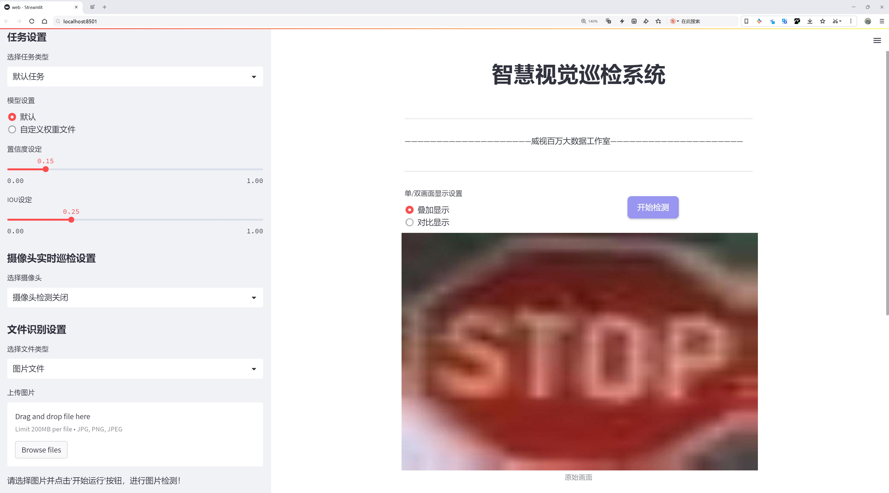
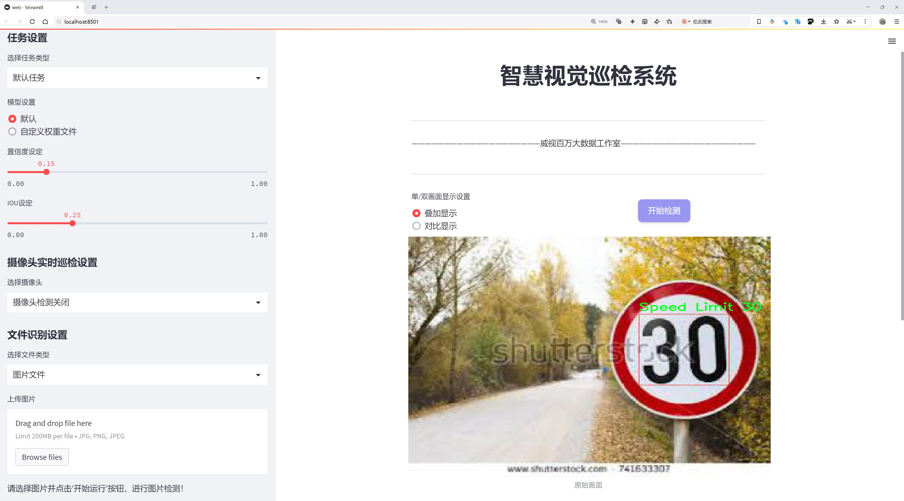
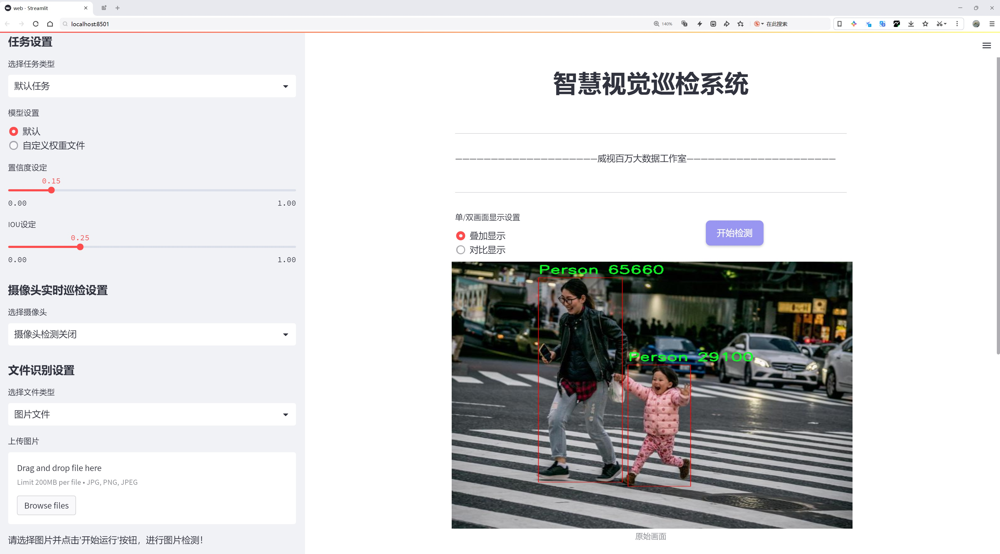
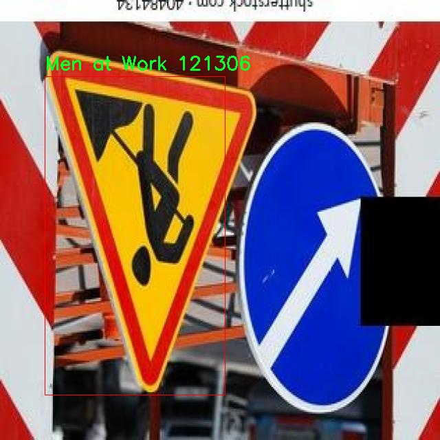
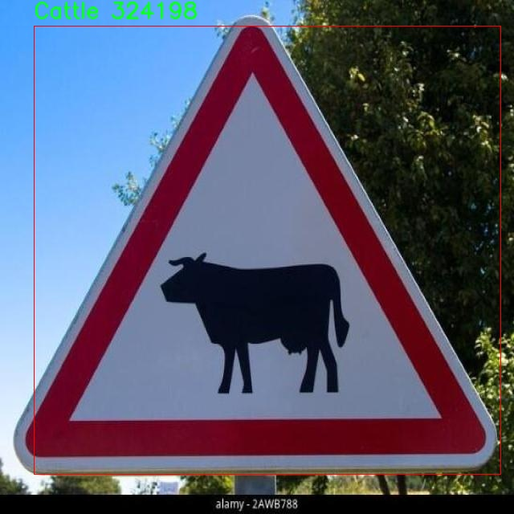

# 交通场景检测系统源码分享
 # [一条龙教学YOLOV8标注好的数据集一键训练_70+全套改进创新点发刊_Web前端展示]

### 1.研究背景与意义

项目参考[AAAI Association for the Advancement of Artificial Intelligence](https://gitee.com/qunmasj/projects)

研究背景与意义

随着城市化进程的加快，交通流量的急剧增加导致了交通安全问题的日益严重。交通事故不仅造成了人员伤亡和财产损失，还对社会的正常运转产生了负面影响。因此，如何有效地监测和管理交通场景，提升交通安全性，成为了交通管理领域亟待解决的重要课题。近年来，计算机视觉技术的迅猛发展为交通场景检测提供了新的解决方案，尤其是基于深度学习的目标检测模型，如YOLO（You Only Look Once）系列，因其高效性和准确性而备受关注。

本研究旨在基于改进的YOLOv8模型，构建一个高效的交通场景检测系统。YOLOv8作为YOLO系列的最新版本，结合了更为先进的特征提取网络和优化算法，能够在保证检测精度的同时显著提高检测速度。通过对交通场景中多种目标的实时检测与识别，能够为交通管理部门提供重要的数据支持，进而实现智能交通系统的构建。

本研究所使用的数据集包含7195张图像，涵盖了74个类别的交通标志、车辆和行人等信息。这些类别包括但不限于交通标志（如限速标志、禁止停车标志）、道路障碍物（如施工标志、窄桥标志）以及行人和车辆等。这一丰富的数据集为模型的训练和测试提供了坚实的基础，使得系统能够在复杂的交通环境中进行准确的目标检测。

通过对这些数据的深入分析与处理，本研究不仅能够提升YOLOv8模型在交通场景中的应用效果，还能够为后续的交通管理与安全研究提供有价值的参考。交通场景检测系统的有效实施，能够实时监测交通流量、识别交通违规行为、预警潜在的交通事故，从而为交通管理决策提供科学依据，提升城市交通的安全性和流畅性。

此外，随着智能交通系统的不断发展，交通场景检测技术的应用前景广阔。该技术不仅可以应用于传统的交通监控，还可以与无人驾驶、智能导航等新兴技术相结合，推动智能交通的进一步发展。因此，本研究不仅具有重要的学术价值，也具有显著的社会意义。通过对交通场景的深入研究与智能化管理，能够有效降低交通事故发生率，提升公众的出行安全感，促进城市交通的可持续发展。

综上所述，基于改进YOLOv8的交通场景检测系统的研究，不仅为交通安全问题提供了新的解决思路，也为未来智能交通系统的构建奠定了基础。通过不断优化和完善该系统，期待能够在实际应用中取得显著成效，为交通管理的智能化和科学化贡献力量。

### 2.图片演示







##### 注意：由于此博客编辑较早，上面“2.图片演示”和“3.视频演示”展示的系统图片或者视频可能为老版本，新版本在老版本的基础上升级如下：（实际效果以升级的新版本为准）

  （1）适配了YOLOV8的“目标检测”模型和“实例分割”模型，通过加载相应的权重（.pt）文件即可自适应加载模型。

  （2）支持“图片识别”、“视频识别”、“摄像头实时识别”三种识别模式。

  （3）支持“图片识别”、“视频识别”、“摄像头实时识别”三种识别结果保存导出，解决手动导出（容易卡顿出现爆内存）存在的问题，识别完自动保存结果并导出到。

  （4）支持Web前端系统中的标题、背景图等自定义修改，后面提供修改教程。

  另外本项目提供训练的数据集和训练教程,暂不提供权重文件（best.pt）,需要您按照教程进行训练后实现图片演示和Web前端界面演示的效果。

### 3.视频演示

[3.1 视频演示](https://www.bilibili.com/video/BV1k1WQeqEdr/?spm_id_from=333.999.0.0&vd_source=ff015de2d29cbe2a9cdbfa7064407a08)

### 4.数据集信息展示

数据集信息展示

本数据集专为改进YOLOv8的交通场景检测系统而设计，涵盖了丰富的交通标志、车辆和行人检测信息。数据集的名称为“Trafficsign, Car, Person-Detection”，其核心目标是为交通监控和自动驾驶技术提供高质量的训练数据，以提升模型在复杂交通环境中的识别能力和准确性。

数据集中包含7195张图像，覆盖了74个不同的类别。这些类别不仅包括常见的交通标志和信号，还涵盖了多种交通场景中的元素，如行人、车辆及其周围环境。这种多样性使得数据集能够为YOLOv8模型提供全面的训练支持，从而提升其在实际应用中的表现。

在类别列表中，我们可以看到诸如“Barrier Ahead”、“Car”、“Person”等基本类别，这些类别在交通场景中具有重要的识别意义。此外，数据集中还包括了一系列特定的交通标志，如“Speed Limit -30-”、“No Parking”、“Pedestrian Crossing”等，这些标志在不同的驾驶环境中起着关键的指引作用。通过对这些标志的有效识别，YOLOv8模型能够更好地理解和解析复杂的交通情境。

数据集中的每个类别都经过精心标注，确保了数据的准确性和可靠性。例如，“Speed Limit”系列类别涵盖了从5到160的多个速度限制标志，这对于自动驾驶系统在不同道路条件下的决策至关重要。同时，数据集中还包括了“Men at Work”、“School Ahead”等类别，这些标志在特定情况下对驾驶安全具有直接影响。

此外，数据集还考虑到了不同交通场景的复杂性，包含了如“Slippery Road”、“Steep Ascent”、“Narrow Bridge”等类别，这些类别能够帮助模型在特定的环境条件下进行更为精准的判断和反应。通过这些丰富的场景设置，YOLOv8模型将能够在真实世界中更好地应对各种突发情况，提升其智能化水平。

值得一提的是，该数据集遵循CC BY 4.0许可证，允许用户在遵循相应条款的前提下自由使用和修改数据。这为研究人员和开发者提供了极大的便利，使他们能够在现有数据的基础上进行创新和探索。

总之，本数据集为YOLOv8的交通场景检测系统提供了一个全面而多样化的训练基础。通过对交通标志、车辆和行人的准确识别，模型将能够在复杂的交通环境中实现更高的智能化水平，为未来的自动驾驶和交通管理系统的发展奠定坚实的基础。随着技术的不断进步和数据集的持续优化，我们期待该模型在实际应用中展现出更为卓越的性能。






### 5.全套项目环境部署视频教程（零基础手把手教学）

[5.1 环境部署教程链接（零基础手把手教学）](https://www.ixigua.com/7404473917358506534?logTag=c807d0cbc21c0ef59de5)


[5.2 安装Python虚拟环境创建和依赖库安装视频教程链接（零基础手把手教学）](https://www.ixigua.com/7404474678003106304?logTag=1f1041108cd1f708b01a)

### 6.手把手YOLOV8训练视频教程（零基础小白有手就能学会）

[6.1 环境部署教程链接（零基础手把手教学）](https://www.ixigua.com/7404477157818401292?logTag=d31a2dfd1983c9668658)

### 7.70+种全套YOLOV8创新点代码加载调参视频教程（一键加载写好的改进模型的配置文件）

[7.1 环境部署教程链接（零基础手把手教学）](https://www.ixigua.com/7404478314661806627?logTag=29066f8288e3f4eea3a4)

### 8.70+种全套YOLOV8创新点原理讲解（非科班也可以轻松写刊发刊，V10版本正在科研待更新）

由于篇幅限制，每个创新点的具体原理讲解就不一一展开，具体见下列网址中的创新点对应子项目的技术原理博客网址【Blog】：


[8.1 70+种全套YOLOV8创新点原理讲解链接](https://gitee.com/qunmasj/good)

### 9.系统功能展示（检测对象为举例，实际内容以本项目数据集为准）

图1.系统支持检测结果表格显示

  图2.系统支持置信度和IOU阈值手动调节

  图3.系统支持自定义加载权重文件best.pt(需要你通过步骤5中训练获得)

  图4.系统支持摄像头实时识别

  图5.系统支持图片识别

  图6.系统支持视频识别

  图7.系统支持识别结果文件自动保存

  图8.系统支持Excel导出检测结果数据


### 10.原始YOLOV8算法原理

原始YOLOv8算法原理

YOLOv8作为YOLO系列的最新进展，代表了目标检测领域中的一项重要创新。它在保持实时性和高效性的同时，进一步提升了检测精度和速度。YOLOv8的设计理念和架构相较于前代版本，尤其是YOLOv5，进行了多方面的优化和改进，使其在不同应用场景中展现出更强的适应性和性能。

首先，YOLOv8的网络结构可以分为四个主要部分：输入端、骨干网络、颈部网络和头部网络。输入端采用了多种数据增强技术，包括马赛克增强、自适应锚框计算和自适应灰度填充，这些技术不仅提高了模型的鲁棒性，还有效地丰富了训练数据，帮助模型更好地学习目标特征。马赛克增强技术通过将多张图像拼接成一张图像，增加了图像的多样性，使得模型在训练过程中能够接触到更多样的目标样式和背景，从而提升其泛化能力。

在骨干网络方面，YOLOv8引入了C2f模块，这一模块是对YOLOv5中C3模块的优化。C2f模块采用了残差连接和跨层连接的设计理念，增强了梯度流的传递，使得深层网络在训练过程中更为稳定。通过引入更多的分支和Bottleneck结构，C2f模块能够提取出更丰富的特征信息，从而提升特征表示能力。与此同时，YOLOv8还保留了空间金字塔池化（SPPF）模块，以进一步增强对多尺度目标的检测能力。

颈部网络采用了路径聚合网络（PAN）结构，这一结构旨在加强不同尺度特征的融合能力。PAN通过自下而上的特征融合，将高层特征与中层和浅层特征进行有效结合，使得模型能够更好地捕捉到目标的细节信息和语义信息。这种特征融合的策略，使得YOLOv8在处理不同大小的目标时，能够更为精准地进行检测。

头部网络则是YOLOv8的另一大亮点。与以往的耦合头不同，YOLOv8采用了解耦结构，将分类和回归过程分开进行。这种设计不仅简化了模型的复杂性，还提高了检测的准确性。YOLOv8的头部网络使用了无锚框（Anchor-Free）检测策略，减少了锚框预测的数量，从而加速了非最大抑制（NMS）过程，提高了整体检测速度。损失计算方面，YOLOv8引入了Task-Aligned Assigner策略，根据分类与回归的分数加权结果选择正样本，结合二元交叉熵损失（BCELoss）和分布焦点损失（DFLoss）以及完全交并比损失（CIOULoss），使得模型在边界框预测的准确性上得到了显著提升。

在YOLOv8的训练过程中，样本匹配策略的改进也是其一大亮点。通过将静态匹配改为Task-Aligned的Assigner匹配方式，YOLOv8能够更灵活地适应不同的样本分布，特别是在面对正负样本不平衡的情况下，能够有效提高模型的学习效率和准确性。此外，YOLOv8在损失函数的设计上也进行了创新，采用了变焦损失（VFLLoss）来计算分类损失，并结合数据平均保真度损失和完美交并比损失来计算边界框损失，这一策略使得YOLOv8在目标检测的精度上更具优势。

YOLOv8的轻量化设计也值得一提。通过对模型结构的精简和优化，YOLOv8能够在保持高检测精度的同时，显著降低模型的参数量和计算复杂度。这使得YOLOv8在边缘设备和实时应用中表现出色，能够在保证实时性的前提下，提供高质量的目标检测结果。

总的来说，YOLOv8在多个方面的创新和改进，使其成为当前目标检测领域中的一项重要技术。通过引入新的网络结构、优化的损失函数和高效的样本匹配策略，YOLOv8不仅提升了检测精度和速度，还在多种应用场景中展现出强大的适应性和灵活性。随着YOLOv8的不断发展和应用，未来的目标检测技术将更加智能和高效。


### 11.项目核心源码讲解（再也不用担心看不懂代码逻辑）

#### 11.1 ultralytics\models\rtdetr\train.py

以下是对给定代码的核心部分进行分析和详细注释的结果：

```python
# Ultralytics YOLO 🚀, AGPL-3.0 license

from copy import copy
import torch
from ultralytics.models.yolo.detect import DetectionTrainer
from ultralytics.nn.tasks import RTDETRDetectionModel
from ultralytics.utils import RANK, colorstr
from .val import RTDETRDataset, RTDETRValidator

class RTDETRTrainer(DetectionTrainer):
    """
    RT-DETR模型的训练类，扩展自YOLO的DetectionTrainer类，适应RT-DETR特有的特性和架构。
    RT-DETR模型利用视觉变换器，具备IoU感知查询选择和可调推理速度等能力。
    """

    def get_model(self, cfg=None, weights=None, verbose=True):
        """
        初始化并返回一个用于目标检测任务的RT-DETR模型。

        Args:
            cfg (dict, optional): 模型配置，默认为None。
            weights (str, optional): 预训练模型权重的路径，默认为None。
            verbose (bool): 如果为True，则启用详细日志，默认为True。

        Returns:
            (RTDETRDetectionModel): 初始化后的模型。
        """
        # 创建RT-DETR检测模型实例
        model = RTDETRDetectionModel(cfg, nc=self.data["nc"], verbose=verbose and RANK == -1)
        # 如果提供了权重，则加载权重
        if weights:
            model.load(weights)
        return model

    def build_dataset(self, img_path, mode="val", batch=None):
        """
        构建并返回用于训练或验证的RT-DETR数据集。

        Args:
            img_path (str): 包含图像的文件夹路径。
            mode (str): 数据集模式，可以是'train'或'val'。
            batch (int, optional): 矩形训练的批量大小，默认为None。

        Returns:
            (RTDETRDataset): 特定模式的数据集对象。
        """
        # 创建RT-DETR数据集实例
        return RTDETRDataset(
            img_path=img_path,
            imgsz=self.args.imgsz,  # 图像大小
            batch_size=batch,        # 批量大小
            augment=mode == "train", # 如果是训练模式，则启用数据增强
            hyp=self.args,          # 超参数
            rect=False,             # 是否使用矩形训练
            cache=self.args.cache or None, # 缓存设置
            prefix=colorstr(f"{mode}: "), # 前缀颜色字符串
            data=self.data,         # 数据集信息
        )

    def get_validator(self):
        """
        返回适合RT-DETR模型验证的DetectionValidator。

        Returns:
            (RTDETRValidator): 模型验证器对象。
        """
        self.loss_names = "giou_loss", "cls_loss", "l1_loss"  # 定义损失名称
        # 创建RT-DETR验证器实例
        return RTDETRValidator(self.test_loader, save_dir=self.save_dir, args=copy(self.args))

    def preprocess_batch(self, batch):
        """
        预处理一批图像。对图像进行缩放并转换为浮点格式。

        Args:
            batch (dict): 包含一批图像、边界框和标签的字典。

        Returns:
            (dict): 预处理后的批次。
        """
        # 调用父类的方法进行预处理
        batch = super().preprocess_batch(batch)
        bs = len(batch["img"])  # 批次大小
        batch_idx = batch["batch_idx"]  # 批次索引
        gt_bbox, gt_class = [], []  # 初始化真实边界框和类别列表
        
        # 遍历每个样本，提取真实边界框和类别
        for i in range(bs):
            gt_bbox.append(batch["bboxes"][batch_idx == i].to(batch_idx.device))  # 获取真实边界框
            gt_class.append(batch["cls"][batch_idx == i].to(device=batch_idx.device, dtype=torch.long))  # 获取真实类别
        return batch  # 返回预处理后的批次
```

### 核心部分分析：
1. **RTDETRTrainer类**：该类是RT-DETR模型的训练类，继承自YOLO的DetectionTrainer，负责模型的训练和验证。
2. **get_model方法**：用于初始化RT-DETR模型，并加载预训练权重。
3. **build_dataset方法**：构建训练或验证数据集，支持数据增强和批量处理。
4. **get_validator方法**：返回用于模型验证的验证器，定义了损失名称。
5. **preprocess_batch方法**：对输入的图像批次进行预处理，提取真实的边界框和类别信息。

这些核心部分构成了RT-DETR模型训练的基础逻辑，确保模型能够有效地进行目标检测任务。

该文件是Ultralytics YOLO项目中的一个训练模块，专门用于RT-DETR（Real-Time DEtection TRansformer）模型的训练。RT-DETR是百度开发的一种实时目标检测模型，结合了视觉变换器（Vision Transformers）和其他先进技术，如IoU感知查询选择和可调的推理速度。该模块继承自YOLO的DetectionTrainer类，适应RT-DETR模型的特性和架构。

文件的开头部分包含了一些重要的注释，说明了RT-DETR模型的一些特点和注意事项，例如F.grid_sample在RT-DETR中不支持`deterministic=True`参数，AMP（自动混合精度）训练可能导致NaN输出和在二分图匹配时出现错误。

在类RTDETRTrainer中，定义了多个方法来实现模型的训练和验证。首先，`get_model`方法用于初始化并返回一个RT-DETR模型，支持传入模型配置和预训练权重的路径。这个方法会根据传入的配置和类别数量（nc）创建RTDETRDetectionModel实例，并在有权重的情况下加载预训练模型。

`build_dataset`方法用于构建和返回RT-DETR数据集，支持训练和验证模式。它接受图像路径、模式（训练或验证）和批量大小作为参数，并返回一个RTDETRDataset对象，负责处理图像的加载和增强。

`get_validator`方法返回一个适用于RT-DETR模型验证的检测验证器RTDETRValidator。这个方法还定义了损失名称，包括giou_loss、cls_loss和l1_loss，用于后续的损失计算和模型评估。

最后，`preprocess_batch`方法用于对一批图像进行预处理。它调用了父类的方法，并对图像进行缩放和转换为浮点格式。该方法还处理了每个图像的真实边界框（gt_bbox）和类别（gt_class），确保它们在同一设备上并具有正确的数据类型。

整体而言，该文件为RT-DETR模型的训练提供了必要的结构和功能，确保模型能够高效地进行目标检测任务。

#### 11.2 ultralytics\__init__.py

以下是代码中最核心的部分，并附上详细的中文注释：

```python
# 导入所需的库和模块
from ultralytics.models import YOLO  # 导入YOLO模型
from ultralytics.utils import SETTINGS as settings  # 导入设置配置
from ultralytics.utils.checks import check_yolo as checks  # 导入YOLO检查工具
from ultralytics.utils.downloads import download  # 导入下载工具

# 定义可导出的模块内容
__all__ = "__version__", "YOLO", "checks", "download", "settings"
```

### 代码注释说明：

1. **导入模块**：
   - `from ultralytics.models import YOLO`：导入YOLO模型，这是一个用于目标检测的深度学习模型。
   - `from ultralytics.utils import SETTINGS as settings`：导入设置配置，通常包含模型训练和推理的参数设置。
   - `from ultralytics.utils.checks import check_yolo as checks`：导入YOLO检查工具，用于验证YOLO模型的有效性和兼容性。
   - `from ultralytics.utils.downloads import download`：导入下载工具，可能用于下载模型权重或数据集。

2. **定义可导出的模块内容**：
   - `__all__`：这是一个特殊变量，用于定义当使用`from module import *`时，哪些模块内容是可以被导出的。在这里，导出了版本信息、YOLO模型、检查工具、下载工具和设置配置。

这个程序文件是Ultralytics YOLO库的初始化文件，文件名为`__init__.py`，它的主要作用是定义包的版本、导入模块以及设置可导出的内容。

首先，文件中定义了一个版本号`__version__`，其值为"8.1.3"，这表明当前库的版本信息，方便用户和开发者了解使用的版本。

接下来，文件通过`from ... import ...`语句导入了多个模块和类。这些导入的内容包括：

- `Explorer`：来自`ultralytics.data.explorer.explorer`模块，可能是用于数据探索或可视化的工具。
- `RTDETR`、`SAM`、`YOLO`：这些是来自`ultralytics.models`模块的模型类，分别代表不同的目标检测模型。
- `FastSAM`：来自`ultralytics.models.fastsam`模块，可能是一个快速的SAM模型实现。
- `NAS`：来自`ultralytics.models.nas`模块，可能与神经架构搜索相关的模型。
- `SETTINGS`：从`ultralytics.utils`模块导入的设置，可能包含库的配置选项。
- `check_yolo`：来自`ultralytics.utils.checks`模块的检查函数，用于验证YOLO模型的有效性。
- `download`：来自`ultralytics.utils.downloads`模块的下载功能，可能用于下载模型或数据集。

最后，`__all__`变量定义了当使用`from ultralytics import *`语句时，哪些名称会被导入。这里列出了版本号、模型类、检查函数、下载功能、设置和Explorer工具。这种做法有助于控制模块的公共接口，确保用户只接触到必要的部分。

总的来说，这个文件是Ultralytics YOLO库的核心部分，负责初始化库的基本信息和功能模块，便于用户进行目标检测和相关任务的开发。

#### 11.3 ui.py

```python
import sys
import subprocess

def run_script(script_path):
    """
    使用当前 Python 环境运行指定的脚本。

    Args:
        script_path (str): 要运行的脚本路径

    Returns:
        None
    """
    # 获取当前 Python 解释器的路径
    python_path = sys.executable

    # 构建运行命令
    command = f'"{python_path}" -m streamlit run "{script_path}"'

    # 执行命令
    result = subprocess.run(command, shell=True)
    if result.returncode != 0:
        print("脚本运行出错。")


# 实例化并运行应用
if __name__ == "__main__":
    # 指定您的脚本路径
    script_path = "web.py"  # 这里直接指定脚本路径

    # 运行脚本
    run_script(script_path)  # 调用函数执行脚本
```

### 代码注释说明：

1. **导入模块**：
   - `sys`：用于访问与 Python 解释器紧密相关的变量和函数。
   - `subprocess`：用于创建新进程、连接到它们的输入/输出/错误管道，并获取它们的返回码。

2. **定义 `run_script` 函数**：
   - 该函数接受一个参数 `script_path`，表示要运行的 Python 脚本的路径。
   - 使用 `sys.executable` 获取当前 Python 解释器的路径，以确保脚本在当前环境中运行。
   - 构建一个命令字符串，使用 `streamlit` 模块运行指定的脚本。
   - 使用 `subprocess.run` 执行命令，并检查返回码以判断脚本是否成功运行。

3. **主程序入口**：
   - 使用 `if __name__ == "__main__":` 确保只有在直接运行该脚本时才会执行以下代码。
   - 指定要运行的脚本路径 `web.py`。
   - 调用 `run_script` 函数，传入脚本路径以执行该脚本。

这个程序文件名为 `ui.py`，主要功能是通过当前的 Python 环境运行一个指定的脚本。代码中首先导入了必要的模块，包括 `sys`、`os` 和 `subprocess`，以及一个自定义的路径处理模块 `abs_path`。

在 `run_script` 函数中，程序接受一个参数 `script_path`，该参数是要运行的脚本的路径。函数内部首先获取当前 Python 解释器的路径，这通过 `sys.executable` 实现。接着，构建一个命令字符串，使用 `streamlit` 模块来运行指定的脚本。这个命令的格式是 `"{python_path}" -m streamlit run "{script_path}"`，其中 `python_path` 是当前 Python 解释器的路径，`script_path` 是要运行的脚本路径。

然后，程序使用 `subprocess.run` 方法执行这个命令，`shell=True` 参数表示在 shell 中执行命令。执行后，程序检查返回的结果码，如果结果码不为零，表示脚本运行出错，程序会打印出相应的错误信息。

在文件的最后部分，使用 `if __name__ == "__main__":` 语句来确保只有在直接运行该文件时才会执行后面的代码。在这里，指定了要运行的脚本路径为 `web.py`，并调用 `run_script` 函数来执行这个脚本。

总体来说，这个程序的主要目的是提供一个简单的接口来运行一个 Streamlit 应用脚本，方便用户在当前 Python 环境中启动和测试应用。

#### 11.4 ultralytics\utils\files.py

以下是代码中最核心的部分，并附上详细的中文注释：

```python
import os
from pathlib import Path
from contextlib import contextmanager

@contextmanager
def spaces_in_path(path):
    """
    处理路径中包含空格的上下文管理器。如果路径包含空格，则用下划线替换它们，
    复制文件/目录到新路径，执行上下文代码块，然后将文件/目录复制回原始位置。

    参数:
        path (str | Path): 原始路径。

    返回:
        (Path): 如果路径中有空格，则返回替换下划线的临时路径，否则返回原始路径。
    """
    if " " in str(path):
        path = Path(path)  # 将路径转换为Path对象
        with tempfile.TemporaryDirectory() as tmp_dir:  # 创建临时目录
            tmp_path = Path(tmp_dir) / path.name.replace(" ", "_")  # 替换空格为下划线的路径

            # 复制文件/目录
            if path.is_dir():
                shutil.copytree(path, tmp_path)  # 复制目录
            elif path.is_file():
                shutil.copy2(path, tmp_path)  # 复制文件

            try:
                yield tmp_path  # 返回临时路径
            finally:
                # 将文件/目录复制回原始位置
                if tmp_path.is_dir():
                    shutil.copytree(tmp_path, path, dirs_exist_ok=True)
                elif tmp_path.is_file():
                    shutil.copy2(tmp_path, path)

    else:
        yield path  # 如果没有空格，直接返回原始路径


def increment_path(path, exist_ok=False, sep="", mkdir=False):
    """
    增加文件或目录路径，即将路径后面加上数字，例如 runs/exp --> runs/exp{sep}2, runs/exp{sep}3 等。

    参数:
        path (str, pathlib.Path): 要增加的路径。
        exist_ok (bool, optional): 如果为True，则路径不会增加，直接返回原路径。默认为False。
        sep (str, optional): 路径和增加数字之间的分隔符。默认为''。
        mkdir (bool, optional): 如果路径不存在，则创建目录。默认为False。

    返回:
        (pathlib.Path): 增加后的路径。
    """
    path = Path(path)  # 转换为Path对象
    if path.exists() and not exist_ok:
        path, suffix = (path.with_suffix(""), path.suffix) if path.is_file() else (path, "")

        # 方法1：增加路径
        for n in range(2, 9999):
            p = f"{path}{sep}{n}{suffix}"  # 增加路径
            if not os.path.exists(p):
                break
        path = Path(p)

    if mkdir:
        path.mkdir(parents=True, exist_ok=True)  # 创建目录

    return path  # 返回增加后的路径


def file_size(path):
    """返回文件/目录的大小（MB）。"""
    if isinstance(path, (str, Path)):
        mb = 1 << 20  # 字节转为MB (1024 ** 2)
        path = Path(path)
        if path.is_file():
            return path.stat().st_size / mb  # 返回文件大小
        elif path.is_dir():
            return sum(f.stat().st_size for f in path.glob("**/*") if f.is_file()) / mb  # 返回目录大小
    return 0.0  # 如果路径无效，返回0.0
```

### 代码说明：
1. **spaces_in_path**: 这是一个上下文管理器，用于处理路径中包含空格的情况。它会创建一个临时路径，将原始路径中的空格替换为下划线，并在执行代码块后将文件或目录复制回原始位置。

2. **increment_path**: 这个函数用于增加文件或目录的路径，确保生成的路径是唯一的。它会在路径后添加一个数字，如果路径已经存在且`exist_ok`为`False`，则会继续增加数字。

3. **file_size**: 这个函数用于返回指定文件或目录的大小，以MB为单位。如果路径是文件，则返回文件大小；如果路径是目录，则返回目录中所有文件的总大小。

这个程序文件是Ultralytics YOLO项目中的一个工具模块，主要用于处理文件和目录的操作。它包含了一些有用的类和函数，帮助用户在进行文件管理时更为方便和高效。

首先，文件中定义了一个`WorkingDirectory`类，它是一个上下文管理器，用于临时更改当前工作目录。通过装饰器或`with`语句，可以在指定的新目录中执行代码，执行完毕后会自动恢复到原来的工作目录。这对于需要在特定目录下执行一系列操作的场景非常有用。

接下来，定义了一个名为`spaces_in_path`的上下文管理器，用于处理路径中包含空格的情况。如果路径中有空格，它会将空格替换为下划线，并将文件或目录复制到新的临时路径中。在执行上下文代码块后，再将文件或目录复制回原来的位置。这种处理方式可以避免在某些情况下因路径中包含空格而导致的问题。

`increment_path`函数用于生成一个递增的文件或目录路径。如果指定的路径已经存在，且`exist_ok`参数为`False`，则会在路径后面添加一个数字后缀以避免冲突。这个函数还可以选择创建目录，方便用户在需要时自动生成路径。

`file_age`和`file_date`函数用于获取文件的修改时间。`file_age`返回自上次修改以来的天数，而`file_date`则返回一个可读的日期格式，方便用户查看文件的最后修改时间。

`file_size`函数用于计算文件或目录的大小。它可以返回指定文件的大小，或者计算一个目录中所有文件的总大小，结果以MB为单位。

最后，`get_latest_run`函数用于查找指定目录下最新的`last.pt`文件，这通常用于模型训练的恢复操作。它会在指定的搜索目录中递归查找所有匹配的文件，并返回最新的一个。

总体来说，这个文件提供了一系列实用的工具函数和类，旨在简化文件和目录的管理，提升用户在使用YOLO模型时的工作效率。

#### 11.5 ultralytics\models\yolo\classify\__init__.py

以下是代码中最核心的部分，并附上详细的中文注释：

```python
# 导入Ultralytics YOLO库中的分类预测、训练和验证模块
from ultralytics.models.yolo.classify.predict import ClassificationPredictor  # 导入分类预测器
from ultralytics.models.yolo.classify.train import ClassificationTrainer      # 导入分类训练器
from ultralytics.models.yolo.classify.val import ClassificationValidator      # 导入分类验证器

# 定义模块的公开接口，允许外部访问这些类
__all__ = "ClassificationPredictor", "ClassificationTrainer", "ClassificationValidator"
```

### 代码注释说明：
1. **导入模块**：
   - `ClassificationPredictor`：用于进行分类预测的类，能够根据输入的数据进行分类。
   - `ClassificationTrainer`：用于训练分类模型的类，负责模型的训练过程。
   - `ClassificationValidator`：用于验证分类模型性能的类，评估模型在验证集上的表现。

2. **`__all__`**：
   - 这是一个特殊的变量，用于定义模块的公开接口。当使用 `from module import *` 时，只有在 `__all__` 中列出的名称会被导入。这有助于控制模块的可见性和防止不必要的名称冲突。

这个文件是Ultralytics YOLO模型库中的一个初始化文件，主要用于分类任务。文件的开头包含了一条注释，表明该项目使用的是AGPL-3.0许可证，并且是Ultralytics YOLO的相关代码。

接下来，文件通过`from`语句导入了三个重要的类：`ClassificationPredictor`、`ClassificationTrainer`和`ClassificationValidator`。这些类分别负责分类任务中的预测、训练和验证功能。具体来说，`ClassificationPredictor`用于执行图像分类的预测，`ClassificationTrainer`用于训练分类模型，而`ClassificationValidator`则用于验证模型的性能。

最后，`__all__`变量被定义为一个元组，包含了上述三个类的名称。这意味着当使用`from ultralytics.models.yolo.classify import *`语句时，只会导入这三个类，从而控制了模块的导出内容，确保只暴露必要的接口给用户。

总体而言，这个文件的主要作用是组织和管理与YOLO分类相关的功能模块，使得用户能够方便地进行模型的训练、预测和验证。

#### 11.6 train.py

以下是经过简化和注释的核心代码部分：

```python
import os
import torch
import yaml
from ultralytics import YOLO  # 导入YOLO模型库
from QtFusion.path import abs_path  # 导入路径处理工具

# 确定使用的设备，优先使用GPU
device = "0" if torch.cuda.is_available() else "cpu"

if __name__ == '__main__':  # 确保该模块被直接运行时才执行以下代码
    workers = 1  # 数据加载的工作进程数
    batch = 2    # 每个批次的样本数

    data_name = "data"  # 数据集名称
    # 获取数据集配置文件的绝对路径
    data_path = abs_path(f'datasets/{data_name}/{data_name}.yaml', path_type='current')  
    unix_style_path = data_path.replace(os.sep, '/')  # 将路径转换为Unix风格

    # 获取数据集目录路径
    directory_path = os.path.dirname(unix_style_path)
    
    # 读取YAML配置文件
    with open(data_path, 'r') as file:
        data = yaml.load(file, Loader=yaml.FullLoader)
    
    # 如果YAML文件中有'path'项，则更新为当前目录路径
    if 'path' in data:
        data['path'] = directory_path
        # 将修改后的数据写回YAML文件
        with open(data_path, 'w') as file:
            yaml.safe_dump(data, file, sort_keys=False)

    # 加载YOLOv8模型配置
    model = YOLO(model='./ultralytics/cfg/models/v8/yolov8s.yaml', task='detect')  
    
    # 开始训练模型
    results2 = model.train(
        data=data_path,  # 指定训练数据的配置文件路径
        device=device,   # 指定训练设备
        workers=workers, # 数据加载的工作进程数
        imgsz=640,       # 输入图像的大小
        epochs=100,      # 训练的轮数
        batch=batch,     # 每个批次的样本数
        name='train_v8_' + data_name  # 训练任务的名称
    )
```

### 代码注释说明：
1. **导入必要的库**：导入操作系统相关的库、PyTorch、YAML处理库以及YOLO模型库。
2. **设备选择**：检查是否有可用的GPU，如果有则使用GPU，否则使用CPU。
3. **主程序入口**：使用`if __name__ == '__main__':`确保只有在直接运行该脚本时才执行后续代码。
4. **参数设置**：设置数据加载的工作进程数和每个批次的样本数。
5. **数据集路径处理**：构建数据集配置文件的绝对路径，并转换为Unix风格路径。
6. **读取和更新YAML文件**：读取数据集的YAML配置文件，更新其中的路径信息，并将修改后的内容写回文件。
7. **模型加载**：加载YOLOv8模型的配置文件。
8. **模型训练**：调用`train`方法开始训练模型，传入必要的参数，包括数据路径、设备、工作进程数、图像大小、训练轮数和批次大小。

这个程序文件 `train.py` 的主要功能是使用 YOLOv8 模型进行目标检测的训练。程序首先导入了必要的库，包括 `os`、`torch`、`yaml` 和 `ultralytics` 中的 YOLO 模型。接着，程序会根据系统是否支持 CUDA 来选择设备，如果支持则使用 GPU（设备编号为 "0"），否则使用 CPU。

在 `if __name__ == '__main__':` 这一块代码中，程序首先定义了一些训练参数，比如工作进程数 `workers` 和批次大小 `batch`。然后指定了数据集的名称，这里使用的是 "data"，并构造出数据集 YAML 文件的绝对路径。为了确保路径在不同操作系统中都能正确使用，程序将路径中的分隔符替换为 Unix 风格的斜杠。

接下来，程序获取了数据集目录的路径，并打开指定的 YAML 文件以读取数据。通过 `yaml.load` 方法读取 YAML 文件内容后，程序检查是否存在 `path` 项，如果存在，则将其修改为当前目录路径，并将修改后的内容写回到 YAML 文件中，以确保数据集路径的正确性。

然后，程序加载了预训练的 YOLOv8 模型，指定了模型的配置文件路径和任务类型为目标检测。最后，程序调用 `model.train` 方法开始训练模型，传入了一系列参数，包括数据配置文件路径、设备选择、工作进程数、输入图像大小、训练的 epoch 数量、批次大小以及训练任务的名称。

整体来看，这段代码实现了从数据集路径的设置到模型训练的完整流程，适合用于目标检测任务的训练。

### 12.系统整体结构（节选）

### 整体功能和构架概括

Ultralytics YOLO项目是一个用于目标检测和图像分类的深度学习框架，旨在提供高效、易用的工具来训练和推理YOLO模型。该项目的整体架构由多个模块组成，每个模块负责特定的功能，包括模型训练、预测、验证、文件管理和用户界面等。通过这些模块，用户可以方便地进行数据准备、模型训练、性能评估和推理等任务。

### 文件功能整理表

| 文件路径                                         | 功能描述                                                                                  |
|--------------------------------------------------|-------------------------------------------------------------------------------------------|
| `ultralytics/models/rtdetr/train.py`            | 实现RT-DETR模型的训练，包含模型初始化、数据集构建、验证器设置和批处理预处理等功能。      |
| `ultralytics/__init__.py`                       | 初始化Ultralytics YOLO库，定义版本号，导入模型和工具函数，设置公共接口。                |
| `ui.py`                                         | 提供一个接口来运行Streamlit应用脚本，方便用户在当前Python环境中启动和测试应用。         |
| `ultralytics/utils/files.py`                    | 提供文件和目录管理工具，包括上下文管理器、路径处理、文件大小计算和最新模型查找等功能。  |
| `ultralytics/models/yolo/classify/__init__.py` | 初始化YOLO分类模块，导入分类预测、训练和验证相关的类。                                  |
| `train.py`                                      | 负责YOLOv8模型的训练，包括数据集路径设置、模型加载和训练参数配置等。                   |
| `ultralytics/trackers/utils/gmc.py`            | 提供与图像处理和跟踪相关的工具函数，具体功能未详细分析。                                |
| `ultralytics/models/fastsam/predict.py`        | 实现FastSAM模型的推理功能，具体细节未详细分析。                                         |
| `web.py`                                        | 提供Web界面功能，可能用于展示模型结果或与用户交互，具体细节未详细分析。                  |
| `ultralytics/models/yolo/pose/train.py`        | 实现YOLO姿态估计模型的训练，具体功能未详细分析。                                        |

以上表格总结了各个文件的主要功能，便于用户理解Ultralytics YOLO项目的结构和功能模块。

注意：由于此博客编辑较早，上面“11.项目核心源码讲解（再也不用担心看不懂代码逻辑）”中部分代码可能会优化升级，仅供参考学习，完整“训练源码”、“Web前端界面”和“70+种创新点源码”以“13.完整训练+Web前端界面+70+种创新点源码、数据集获取”的内容为准。

### 13.完整训练+Web前端界面+70+种创新点源码、数据集获取


#完整训练+Web前端界面+70+种创新点源码、数据集获取链接

https://mbd.pub/o/bread/ZpqUlZdy